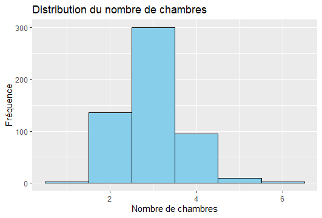
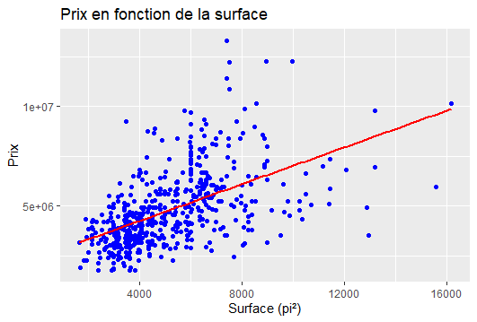

## Tache 1 : Implémentation d'un sous-ensemble de NumPy en Python pur

Ce repository contient une implémentation d'une classe `Matrice` en Python pur, qui offre des fonctionnalités similaires à la bibliothèque NumPy, sans dépendre de bibliothèques externes.

La classe `Matrice` permet de créer des tableaux 1D et 2D et de réaliser des opérations de base telles que :

- **Création de tableaux** à partir de listes Python.
- **Opérations éléments par éléments** : addition (+), soustraction (-), multiplication (\*), division (/).
- **Multiplication avec un scalaire** avec l'opérateur '@'.
- **Recherche d'éléments** avec l'opérateur 'in'.
- **Indexage et Slicing** comme dans NumPy.

## Installation

Vous pouvez installer le package Python `matrice-ifri` via pip :

```
pip install matrice-ifri
```
## Utilisation

```
from matrice_ifri import Matrice

# Créer un tableau 1D
array1d = Matrice([1, 2, 3, 4, 5])

# Créer un tableau 2D
array2d = Matrice([[1, 2], [3, 4]])

# Opérations de base
print(array1d + Matrice([5, 4, 3, 2, 1]))  # Addition
print(array1d * 2)  # Multiplication par un scalaire
print(array1d @ 2)  # Multiplication avec un scalaire (@)
print(5 in array1d)  # Recherche d'élément
print(array2d[0, 1])  # Indexage
print(array1d[1:4])  # Slicing 

```

## Code source

Le code source de la classe `Matrice` est disponible dans le fichier `numpy.py` du dossier `task_1`.

## Tache 2 : Tracé de Graphiques et Analyse de Données en Python et R

Dans cette tâche, contenue dans le dossier `task_2`, nous devons analyser le dataset [Housing Prices Dataset](https://www.kaggle.com/datasets/yasserh/housing-prices-dataset) de Kaggle et sortir :

* Un histogramme
* Un graphique nuage de point (scatter plot).

Pour l'histogramme, utilisez la colonne 'bedrooms'. Pour le graphique de dispersion, utilisez la colonne 'area' en abscisse et 'price' en ordonnées. 

Vous trouverez les graphiques et l'analyse complémentaire ci-dessous.

### Histogramme des Chambres à Coucher



### Analyse de l’histogramme :

L'analyse des données de chambres à coucher montre que la plupart des maisons dans le dataset ont entre 2 et 4 chambres, avec un pic autour à 3 chambres. Les maisons avec moins de 2 chambres ou plus de 5 chambres sont rares, ce qui indique que les logements plus grands sont moins courants.

### Graphique de Dispersion : Superficie vs Prix



### Analyse du graphique de nuage de points :

Le graphique de nuage de points montre une tendance positive entre la superficie ('area') et le prix des maisons. Cela signifie qu'en général, les logements plus grands sont plus chers que les logements plus petits. Cette tendance est illustrée par la forme générale du nuage de points, qui présente une inclinaison positive. 


## Tâche 3 : Générateur d'Images avec Tkinter et Hugging Face

Ce repository contient dans le dossier `task_3` une application GUI en Python utilisant Tkinter pour générer des images à partir de descriptions textuelles. Le programme utilise des modèles de génération d'images pré-entraîné de Hugging Face pour transformer le texte en une image.

**Fonctionnalités:**

* **Champ de texte d'entrée:** Permet à l'utilisateur de saisir une description textuelle.
* **Bouton "Générer":** Lance le processus de génération d'image.
* **Affichage de l'image:** Affiche l'image générée dans une fenêtre séparée.

**Utilisation:**

1. **Installez les dépendances:**

   ```bash
   cd task_3
   pip install -r requirements.txt
   ```

2. **Exécutez le code:**

   ```bash
   main.py
   ```

3. **Saisissez une description textuelle:** dans le champ `prompt`.
4. **Selectionnez le modele:** choisissez entre les modeles disponibles.
5. **Cliquez sur "Générer":** pour générer l'image.

**Configuration:**

* Le code utilise les modèles `hf-internal-testing/tiny-stable-diffusion-pipe` et `segmind/tiny-sd`.

**Remarques:**

* Le programme utilise le processeur pour générer les images.
* Le temps de génération des images peut varier en fonction de la complexité de la description et du modèle utilisé. 
* Les modèles de génération d'images peuvent générer des images variées et parfois surprenantes. 

**Code source:**

Le code source du programme se trouve dans le fichier `main.py`.


